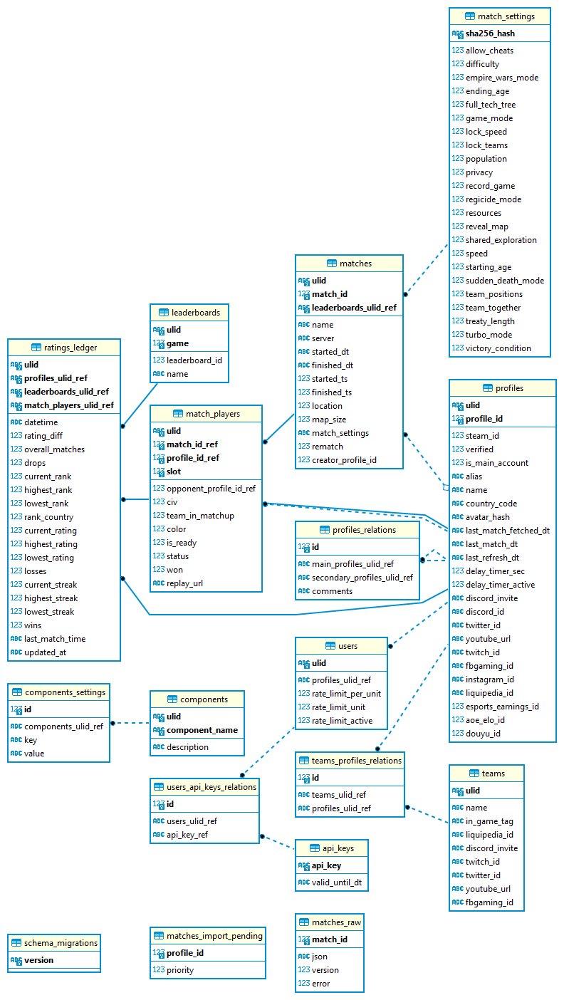

# librematch-database

Migrations for the Libre:Match Database

<!-- TODO RELEASE
## Open source data

Database dumps can be queried from the `https://api.librematch.org/v1/dumps` endpoint. 

A new database dump is generated every first day of the month at ~4 AM UTC time for the last month.

In case you will use the data, please mention the source (Relic Link API and Libre:Match) and give us a shoutout, thank you!
-->

## Development

`librematch_dev.sqlite3` is the database that can be used for local development of the `collector` and other components.

## Entity-Relationship diagram (updated at 2022-10-21)

## Setup

Install [dbmate](https://github.com/amacneil/dbmate).

## Running Migrations

- Create database and migrate to the latest version

  `dbmate --url <database_driver://db_url> up`

- Rollback the latest migration

  `dbmate --url <database_driver://db_url> down`

- Drop database if it exists

  `dbmate --url <database_driver://db_url> drop`

### Example

`dbmate up`
`dbmate down`
`dbmate drop`
(by using the `.env` file in the `root-dir` of this repository)

## License

AGPL-3.0-or-later; see [LICENSE](./LICENSE).
