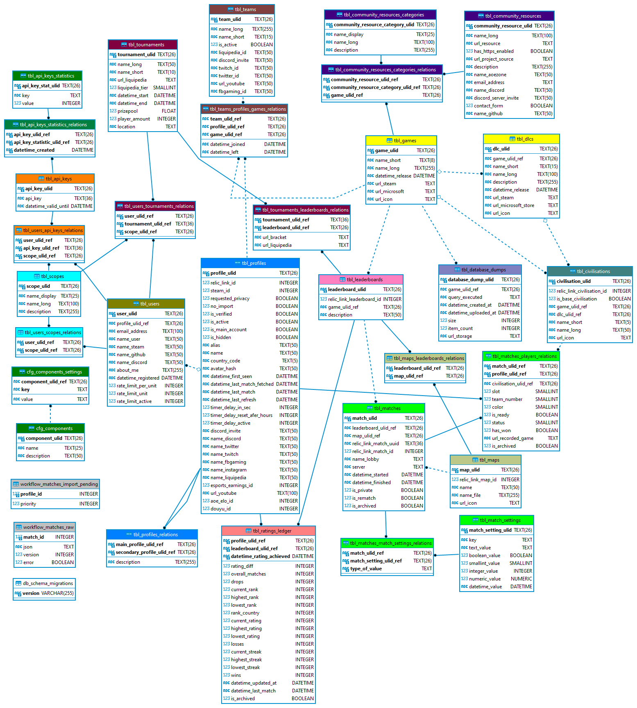

# librematch-database

Migrations for the Libre:Match Database

## Development

`librematch_dev.sqlite3` is the database that can be used for local development of the `collector` and other components.

## Entity-Relationship diagram (updated at 2022-10-20)

## Setup

Install [dbmate](https://github.com/amacneil/dbmate).

## Running Migrations

- Create database and migrate to the latest version

  `dbmate --url <database_driver://db_url> up`

- Rollback the latest migration

  `dbmate --url <database_driver://db_url> down`

- Drop database if it exists

  `dbmate --url <database_driver://db_url> drop`

### Example

`dbmate --url "sqlite:./librematch_dev.sqlite3" up`

## License

AGPL-3.0-or-later; see [LICENSE](./LICENSE).
